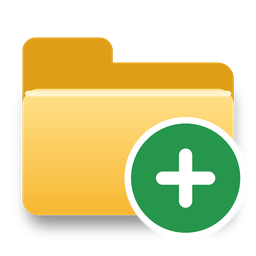

# Folder Template Maker



Build a folder structure once - say a **Diligence folder** with all the sub folders you always need -
save it as a **template**, then create a fresh copy of it anywhere (a OneDrive folder, for example)
with whatever name you like, in one click. Optionally it can also drop a ready-made text document into
any of the folders, named after the new folder (for example `Xcom Diligence raw data.txt`).

No more copying a template folder from your desktop and renaming it by hand.

1. **Pick** a template from your list.
2. **Choose where** it goes (browse, or jump straight to OneDrive) and **type a name** - e.g. `Xcom Diligence`.
3. Click **Create folders**.

Nothing that already exists on your computer is ever overwritten, moved or deleted. The program only
creates new folders and new files.

---

## Get the program (Windows)

You do **not** need to install Python or anything else. It is one file: `FolderTemplateMaker.exe`.

1. On this GitHub page click **Actions** (top menu), then **Test and build**, then open the newest run
   that has a green tick.
2. Scroll to the bottom of that page to **Artifacts** and download **FolderTemplateMaker-windows**.
   It arrives as a zip - right-click it and choose *Extract All*.
3. Move `FolderTemplateMaker.exe` anywhere you like - the Desktop is fine - and double-click it.
   To keep it handy: right-click it > *Send to* > *Desktop (create shortcut)* (on Windows 11 click
   *Show more options* first), or choose *Pin to taskbar*.

If a **Release** has been published (see the *Releases* link on the right of this page), you can download
the `.exe` from there directly instead of going through Actions.

**The first time you run it, Windows may show a blue box saying "Windows protected your PC".**
That happens to every program that isn't signed with a paid certificate. Click **More info**, then
**Run anyway**. (You can also right-click the downloaded file, choose *Properties* and tick *Unblock*.)
If your computer is managed by an employer and blocks unsigned programs, ask your IT team, or run it from
the Python source instead (below). A few antivirus products raise a false alarm for programs packaged
this way; if yours does, the source is all here to inspect and build yourself.

### Prefer to run it from the source code?

Install the latest Python from <https://www.python.org/downloads/> (3.11 or newer; the installer includes
everything needed), then double-click **`FolderTemplateMaker.pyw`** - or run
`python -m foldertemplatemaker` in a terminal. To make your own `.exe`, double-click **`build_exe.bat`**.

---

## Using it

### Make a template

1. Under **My templates** click **New**.
2. Type a **Template name** (how it appears in your list, e.g. `Diligence folder template`) and a
   **Top folder name** (the folder that gets created, e.g. `Diligence folder`).
3. Select the top folder in the tree and click **Add subfolder**. Type a name and press **Enter**; keep
   typing names and pressing Enter to add more. Press **Esc**, or Enter on an empty line, when you're done.
   Click a folder first to add subfolders *inside* it.
4. Tidy up with **Rename** (or F2 / double-click), **Delete**, and the **Rearrange** buttons - or just drag
   folders around with the mouse. Right-click anything for a menu.
5. Click **Save template** (Ctrl+S).

Handy extras:

* **Add several...** - paste a whole list of folder names in one go; indent a line to make it a sub folder.
* **File > Import template from an existing folder...** - point it at a folder you already have (like the
  templates on your desktop) and it becomes a template. Only the folders are imported; files inside are ignored.
* **Copy** duplicates a template so you can make a variation.
* You can have as many templates as you like.

### Create folders from a template

1. Click the template in the list.
2. **Create it in** - type or paste a path, click **Browse...**, or open **Quick places** to jump to OneDrive,
   Documents, Desktop or somewhere you used recently. The program remembers the last place you used for each
   template, so next time it's already filled in.
3. **Name the new folder** - it starts out as the template's top folder name; type whatever you want,
   e.g. `Xcom Diligence`. A line underneath shows exactly what will be created.
4. Click **Create folders** (or press Enter in the name box). A green line confirms what was made, and
   **Open folder** takes you straight there.

If a folder with that name already exists you're asked whether to add any *missing* pieces to it; whatever
is already there is left exactly as it is.

What you see in the tree is what gets created - even if you haven't saved your latest tweaks yet.

### Documents inside folders

Select a folder and click **Add document...** to have a text file created in that folder every time you use
the template. Its name and its text can contain **placeholders** that are filled in when the folder is created:

| Placeholder    | Becomes                                                   | Example                     |
|----------------|-----------------------------------------------------------|-----------------------------|
| `{title}`      | the name you give the new folder                          | `Xcom Diligence`            |
| `{folder}`     | the name of the folder the document sits in               | `Work product`              |
| `{template}`   | the template's name                                       | `Diligence folder template` |
| `{date}`       | today's date                                              | `2026-10-06`                |
| `{date_long}`  | today's date, written out                                 | `October 6, 2026`           |
| `{year}`       | the current year                                          | `2026`                      |

So a document named `{title} raw data` inside the *Work product* folder, with the text
`Raw data for {title} - created {date_long}`, is created as `Xcom Diligence raw data.txt` containing
`Raw data for Xcom Diligence - created October 6, 2026`. The first template you see already has this example.
If the file already exists it is never replaced.

### Good to know

* Folder and file names follow the Windows (and OneDrive) rules: they can't contain `\ / : * ? " < > |`, can't
  end with a space or a period, and can't be reserved names like `CON` or `NUL`. The program tells you if a
  name won't work.
* Two items in the same folder can't share a name - Windows treats `Legal` and `legal` as the same.
* Windows can't handle paths longer than about 259 characters. If a structure would be too deep for the place
  you chose, the program says so *before* creating anything.
* Keyboard: **Insert** add subfolder, **F2** rename, **Delete** delete, **Ctrl+S** save, **Ctrl+N** new
  template, **Ctrl+Enter** create.

### Where your templates are kept

In `%APPDATA%\FolderTemplateMaker` (paste that into the address bar of a File Explorer window; **File > Open
the folder where templates are kept** does it for you). `templates.json` holds your templates and a
`templates.json.bak` copy of the previous save is kept automatically. If a file is ever damaged it's set
aside rather than overwritten.

To move templates to another computer use **File > Export this template to a file...** and, on the other
computer, **File > Import template file...**. (Advanced: set the environment variable
`FOLDER_TEMPLATE_MAKER_HOME` to a folder - for example one inside OneDrive - to keep the program's data
there.)

### If something goes wrong

* **"The folder can't be created yet"** - the message says why (a name Windows doesn't allow, a destination
  that doesn't exist, a path that would be too long...). Nothing has been created when you see it.
* **The program closes or shows an "unexpected error"** - details are written to `error.log` in the folder
  described above. Your templates are not affected.
* **Uninstalling** - delete `FolderTemplateMaker.exe`. To also remove your saved templates, delete the
  `%APPDATA%\FolderTemplateMaker` folder (export anything you want to keep first).

---

## For developers

```
FolderTemplateMaker.pyw        double-click launcher (no console window)
foldertemplatemaker/
  names.py      Windows/OneDrive name rules and {placeholder} substitution
  model.py      folder/document tree, editing operations, outline parsing, folder import
  builder.py    validates a request, then creates folders/documents (never overwrites)
  storage.py    templates.json / settings.json, atomic writes, backups, damaged-file handling
  osutil.py     the few OS-specific bits (data folder, Explorer, OneDrive, DPI)
  editor.py     the tree editor widget (inline rename, drag and drop)
  dialogs.py    document / add-several / help pop-ups
  gui.py        the main window
  app.py        entry point, plus the --selftest used by the build
tests/          unit tests, plus GUI tests that drive the real window
packaging/      build_exe.py (PyInstaller) - build_exe.bat at the top level calls it
assets/         icon (assets/make_icon.py regenerates it; needs Pillow)
```

The program uses only the Python standard library (tkinter for the window).

```
python -m unittest discover -s tests -t .          # all tests
xvfb-run -a python -m unittest discover -s tests -t .   # on Linux, so the GUI tests have a display
python -m foldertemplatemaker --selftest            # drives the real program end to end and exits
python packaging/build_exe.py                       # builds dist/FolderTemplateMaker.exe (Windows)
```

GUI tests are skipped automatically when there is no display. `FOLDER_TEMPLATE_MAKER_HOME` points the
program at a different data folder, which the tests use.

**Continuous integration** (`.github/workflows/build.yml`): every push runs the whole test suite on Windows,
builds `FolderTemplateMaker.exe`, starts that exe in `--selftest` mode to prove it works, and uploads it as an
artifact. To publish it as a downloadable Release, push a tag like `v1.0.0`, or open **Actions > Test and
build > Run workflow** and tick *publish_release*. Bump `__version__` in `foldertemplatemaker/__init__.py`
first so the release and the exe's file properties show the right number.
